# TikTo AWS Infrastructure (IaC)

This repository defines the AWS cloud infrastructure layer for TikTo using modular Terraform. It provisions the networking, security, compute foundation, managed Kubernetes (EKS), centralized logging (AWS OpenSearch), and secret management (AWS Secrets Manager).

Terraform is responsible for the cloud foundation, IAM policies, and managed services. Application workloads, GitOps reconciliation, and runtime controllers (Argo CD, External Secrets Operator, Fluent Bit) are deployed via the GitOps repository.

## Key Capabilities

- **Modular Architecture**: Reusable Terraform modules for AWS VPC, EC2 instances, EKS Node Groups, AWS OpenSearch Service, and AWS Secrets Manager.
- **Production High Availability**: Multi-AZ Amazon EKS Cluster (`v1.31`) backed by Spot/On-Demand mixed instance types for ~70% cost savings.
- **Centralized Logging**: AWS OpenSearch Service (`v2.11`) deployed in Multi-AZ VPC mode for Production log aggregation and Kibana dashboards.
- **Automated Secret Provisioning**: AWS Secrets Manager integrated with local `.env` parsing for `tikto/dev` and `tikto/prod` secret keys.
- **Automated IAM Security**: Dedicated IAM policies attached to EKS worker node roles for passwordless OpenSearch log ingestion and External Secrets Operator access.
- **Remote State Locking**: Configured with Amazon S3 backend and DynamoDB locking.

## Architecture Topology


### Interactive Mermaid Flowchart

Below is the native version-controlled system architecture diagram:

```mermaid
graph LR
    %% Styles and colors
    classDef git fill:#F5F5F5,stroke:#9E9E9E,stroke-width:1px,color:#333;
    classDef public fill:#E3F2FD,stroke:#2196F3,stroke-width:1px,color:#0D47A1;
    classDef private fill:#EDE7F6,stroke:#673AB7,stroke-width:1px,color:#311B92;
    classDef aws fill:#FFF3E0,stroke:#FF9800,stroke-width:1px,color:#E65100;
    classDef vpn fill:#E8F5E9,stroke:#4CAF50,stroke-width:1px,color:#1B5E20;

    %% Outside VPC
    GitHub["GitHub (gitops-manifest)"]:::git
    User["End User"]:::git
    Admin["DevOps Admin"]:::git
    Tailscale["Tailscale VPN"]:::vpn

    subgraph AWS_Cloud ["AWS Cloud (ap-southeast-1 Singapore)"]
        EKS_Control["AWS Managed EKS Control Plane (Outside Customer VPC)"]:::aws

        subgraph VPC ["AWS VPC (10.0.0.0/16)"]
            %% Public Subnet
            subgraph Public_Subnet ["Public Subnet (10.0.1.0/24)"]
                IGW["Internet Gateway (IGW)"]:::public
                NAT["NAT Gateway"]:::public
                ALB["AWS Application Load Balancer"]:::public
                ArgoCD["Argo CD Server (EC2)"]:::public
            end

            %% Private Subnets
            subgraph Private_Subnets ["Private Subnets"]
                %% K3s Dev
                subgraph K3s_Dev ["Single-node K3s (Dev) Cluster"]
                    K3s_Pods["App Pods & Fluent Bit"]:::private
                end

                %% EKS Prod
                subgraph EKS_Prod ["AWS EKS Cluster (Prod)"]
                    Ingress["Ingress"]:::private
                    Service["Service"]:::private
                    
                    subgraph Managed_Node_Group ["Managed Node Group"]
                        Worker1["Worker Node 1<br>(App Pods, Fluent Bit)"]:::private
                        Dots["..."]:::private
                        WorkerN["Worker Node N"]:::private
                    end
                    
                    LBC["AWS Load Balancer Controller"]:::private
                end

                %% VPC Endpoints
                VPCEndpoint["VPC Endpoint (PrivateLink)"]:::public
            end
        end

        %% Regional Services
        Secrets["AWS Secrets Manager"]:::aws
        OpenSearch["AWS OpenSearch Service<br>(OpenSearch Dashboards)"]:::aws
    end

    %% External Controls & GitOps
    GitHub -->|GitOps Pull| ArgoCD
    Admin -->|Secure Admin Tunnel| Tailscale
    Tailscale -.->|Manage UI/SSH| ArgoCD
    Tailscale -.->|Manage API/SSH| K3s_Dev
    Tailscale -.->|Manage Kibana Dashboards| OpenSearch

    %% User Inbound Data Path (Blue)
    style User fill:#BBDEFB,stroke:#1565C0
    User -->|HTTP/HTTPS Port 80/443| IGW
    IGW --> ALB
    ALB --> Ingress
    Ingress --> Service
    Service --> Worker1
    Service --> WorkerN

    %% Outbound Egress Traffic (NAT Gateway)
    K3s_Pods --> NAT
    Worker1 --> NAT
    WorkerN --> NAT
    NAT --> IGW
    IGW -->|Outbound Internet Access| Internet["Public Package Repositories"]:::git

    %% GitOps Sync (Dashed)
    ArgoCD -.->|Sync Dev Manifests| K3s_Dev
    ArgoCD -.->|Sync Prod Manifests| EKS_Control
    EKS_Control -.->|Manage Workloads| Managed_Node_Group

    %% AWS Load Balancer Controller Loop
    Ingress -.->|Watched by| LBC
    LBC -.->|Provision & Update| ALB

    %% VPC Endpoints & Regional Services
    K3s_Pods & Worker1 & WorkerN --> VPCEndpoint
    VPCEndpoint --> Secrets
    VPCEndpoint --> OpenSearch
```



```text
+---------------------------------------------------------------------------------------------------+
|                                 AWS CLOUD (ap-southeast-1 Singapore)                              |
|                                                                                                   |
|  +---------------------------------------------------------------------------------------------+  |
|  |                                  AWS VPC (10.0.0.0/16)                                     |  |
|  |                                                                                             |  |
|  |  [Internet Gateway] ◄───► [NAT Gateway]                                                     |  |
|  |                                                                                             |  |
|  |  +---------------------------+   +---------------------------+   +-----------------------+  |  |
|  |  | DEV SUBNET (10.0.1.0/24)  |   | PROD SUBNET 1 (10.0.2.0)  |   | PROD SUBNET 2 (10.0.3)|  |  |
|  |  | [AZ: ap-southeast-1a]     |   | [AZ: ap-southeast-1a]     |   | [AZ: ap-southeast-1b] |  |  |
|  |  |                           |   |                           |   |                       |  |  |
|  |  |  [argo_server (EC2)]      |   |  [EKS Worker Node 1]      |   |  [EKS Worker Node 2]  |  |  |
|  |  |  k3s + Argo CD (GitOps)   |   |  Spot t3.medium           |   |  Spot t3a.medium      |  |  |
|  |  |  IP: 10.0.1.10            |   |                           |   |                       |  |  |
|  |  |                           |   |  [OpenSearch Data Node 1] |   | [OpenSearch Node 2]   |  |  |
|  |  |  [k3s_dev (EC2)]          |   |  t3.medium.search         |   | t3.medium.search      |  |  |
|  |  |  Single Node K3s          |   +---------------------------+   +-----------------------+  |  |
|  |  |  IP: 10.0.1.12            |                                                              |  |
|  |  +---------------------------+   +-------------------------------------------------------+  |  |
|  |                                  | PROD SUBNET 3 (10.0.4.0/24 - AZ: ap-southeast-1c)     |  |  |
|  |                                  |  [EKS Worker Node 3] (Spot t2.medium)                 |  |  |
|  |                                  +-------------------------------------------------------+  |  |
|  |                                                                                             |  |
|  |  +---------------------------------------------------------------------------------------+  |  |
|  |  |                      AWS EKS PRODUCTION CLUSTER (v1.31)                              |  |  |
|  |  |  [AWS Managed Control Plane] ◄──► [EKS Worker Nodes (App Pods & Fluent Bit)]          |  |  |
|  |  +---------------------------------------------------------------------------------------+  |  |
|  |                                                                                             |  |
|  |  +---------------------------------------------------------------------------------------+  |  |
|  |  |                      VPC ENDPOINTS (AWS PrivateLink)                                  |  |  |
|  |  |  [Secrets Manager Endpoint]                 [OpenSearch VPC Endpoint]                 |  |  |
|  |  +---------------------------------------------------------------------------------------+  |  |
|  |                                                                                             |  |
|  |  +----------------------------+             +--------------------------------------------+  |  |
|  |  |   AWS SECRETS MANAGER      |             |       AWS OPENSEARCH SERVICE (v2.11)       |  |  |
|  |  |   Keys: tikto/dev & prod   |             |       Private VPC Endpoint (HTTPS: 443)    |  |  |
|  |  +----------------------------+             +--------------------------------------------+  |  |
|  +---------------------------------------------------------------------------------------------+  |
+---------------------------------------------------------------------------------------------------+
```


| Environment | Component / Resource | AZ | Private IP / Subnet | Type / Engine | Disk / Nodes | Public / Admin Ingress |
|---|---|---|---|---|---|---|
| Management | `argo_server` | `ap-southeast-1a` | `10.0.1.10` | EC2 (`t3.small`) / k3s + Argo CD | 20 GB EBS | HTTPS `443` (Restricted via Tailscale VPN) |
| Development | `k3s_dev` | `ap-southeast-1a` | `10.0.1.12` | EC2 (`t3.small`) / Single-node k3s | 20 GB EBS | TCP `30080`, `30443` (Dev NodePort) |
| Production | `eks_prod` | Multi-AZ (1a, 1b, 1c) | `10.0.2.0/24`, `10.0.3.0/24`, `10.0.4.0/24` | AWS EKS Managed Node Group (v1.31) | 3 Spot Nodes (`t3.medium`, `t3a.medium`) | Managed AWS Application LoadBalancer (ALB) |
| Production Logs | `opensearch_prod` | Multi-AZ (1a, 1b) | `10.0.2.0/24`, `10.0.3.0/24` | AWS OpenSearch Service (`v2.11`) | 2 Data Nodes (60 GB Total gp3 EBS) | HTTPS `443` (Restricted via VPC Endpoint) |
| Secrets | AWS Secrets Manager | Global VPC | - | `tikto/dev` & `tikto/prod` | Injected from local `.env` | VPC Endpoint Private Access |

## Dual Access Flow Architecture

The system enforces strict network segregation between **End Users (Public Traffic)** and **DevOps / Admins (Management Traffic)**:

```text
[ END USERS / PUBLIC TRAFFIC ]
Internet ──────► AWS Application Load Balancer (ALB) ──────► EKS Ingress / Service ──────► TikTo App Pods (Port 80)

[ DEVOPS / ADMIN MANAGEMENT TRAFFIC ]
DevOps Admin ──► Tailscale VPN ──► Private VPC Network (10.0.0.0/16)
                                     ├──► Dedicated Argo CD Server (Port 80/443 Web UI & Port 22 SSH)
                                     ├──► K3s Dev Kubernetes API (Port 6443) & SSH
                                     ├──► EKS Managed Control Plane API (Port 443)
                                     └──► OpenSearch Dashboards / Kibana (Port 443)
```

| Traffic Category | Target Service | Entry Point / Access Method | Authentication & Security Control |
|---|---|---|---|
| **Public User Traffic** | `tikto-prod` Web / API App | Public Internet Gateway ➔ AWS ALB | Public TLS/SSL, WAF, Restricted to App Port `80` |
| **DevOps Admin Traffic** | EKS Cluster Management | Tailscale VPN ➔ EKS Control Plane API | AWS IAM Role Authenticated, RBAC Kubernetes Permissions |
| **DevOps Admin Traffic** | Argo CD GitOps Dashboard | Tailscale VPN ➔ `https://10.0.1.10` | Argo CD Admin Authentication, Tailscale Encrypted tunnel |
| **DevOps Admin Traffic** | OpenSearch / Kibana Logs | Tailscale VPN ➔ `https://<OPENSEARCH_VPC_ENDPOINT>` | Security Group restricting access to VPC / VPN CIDR |
| **VPN Access Gateway** | Entire AWS VPC (`10.0.0.0/16`) | Tailscale Subnet Router on `argo_server` | Encrypted P2P WireGuard Tunnel, Tailscale Auth Key |


## Network Design

| Resource | Value |
|---|---|
| AWS Region | `ap-southeast-1` (Singapore) |
| VPC CIDR | `10.0.0.0/16` |
| Dev subnet | `10.0.1.0/24` in `ap-southeast-1a` |
| Prod Subnet 1 | `10.0.2.0/24` in `ap-southeast-1a` |
| Prod Subnet 2 | `10.0.3.0/24` in `ap-southeast-1b` |
| Prod Subnet 3 | `10.0.4.0/24` in `ap-southeast-1c` |
| Internet Access | Internet Gateway and public route table |

## Repository Structure

```text
IaC/
├── main.tf                 # Main infrastructure orchestration
├── variables.tf            # Global input variable definitions
├── outputs.tf              # Infrastructure output definitions
├── terraform.tfvars        # Infrastructure environment configuration
├── secrets_and_iam.tf      # Local .env secret parser, Secrets Manager, and EKS IAM policies
├── .env.example            # Sample environment variables template
├── module/
│   ├── vpc/                # Reusable VPC module
│   ├── ec2/                # Reusable EC2 module (Argo CD & Dev k3s)
│   ├── eks/                # Reusable AWS EKS Managed NodeGroup module
│   ├── opensearch/         # Reusable AWS OpenSearch Managed Cluster module
│   └── secrets_manager/    # Reusable AWS Secrets Manager module
└── scripts/
    ├── common/             # Base OS and Docker initialization scripts
    ├── k3s/                # k3s installation and Argo CD setup scripts
    └── nodes/              # Standalone EC2 node setup wrappers
        ├── README.md
        ├── argo_server/
        └── k3s_dev/
```

## Security and Operations

- **Root EBS Volumes**: Encrypted using AWS managed keys (`gp3`).
- **OpenSearch Security**:
  - Enforces HTTPS (TLS 1.2 minimum).
  - Node-to-node encryption and encryption-at-rest enabled.
  - Security Group restricts port `443` access exclusively to the internal VPC CIDR (`10.0.0.0/16`).
- **IAM Policies (Least Privilege)**:
  - `secrets_manager_read`: Grants `secretsmanager:GetSecretValue` on `tikto/*` secrets to EKS worker node roles for External Secrets Operator.
  - `opensearch_ingest`: Grants `es:ESHttpPost` and `es:ESHttpPut` to EKS worker node roles for Fluent Bit log ingestion without storing credentials in pods.
- **Secret Management**:
  - Local `.env` file (if present) is parsed at provision time and synced to AWS Secrets Manager keys (`tikto/dev` and `tikto/prod`).
  - `.env` files are ignored in `.gitignore` to prevent secret leaks.

## Deployment Instructions

### 1. Configure Local Secrets (Optional)
Copy the template and populate runtime variables:
```bash
cp .env.example .env
```

### 2. Provision Infrastructure
```bash
terraform init
terraform plan
terraform apply
```

### 3. Access EKS Cluster
Once Terraform completes, update your local `kubeconfig` to connect to the EKS Production cluster:
```bash
aws eks update-kubeconfig --region ap-southeast-1 --name tikto-prod-eks
kubectl get nodes
```

## Outputs

| Output | Description |
|---|---|
| `vpc_id` | AWS VPC ID |
| `argo_server_public_ip` | Public IP for dedicated Argo CD Management Server |
| `dev_k3s_public_ip` | Public IP for Dev K3s EC2 Node |
| `prod_eks_cluster_name` | Production EKS Cluster Name (`tikto-prod-eks`) |
| `prod_eks_cluster_endpoint` | Production EKS Cluster API Endpoint |
| `opensearch_domain_endpoint` | Private VPC Endpoint URL for OpenSearch |
| `opensearch_kibana_endpoint` | OpenSearch Dashboards Web Endpoint |

## Notes

- Terraform version: `>= 1.10`
- AWS region: `ap-southeast-1`
- Project Name: `tikto`
