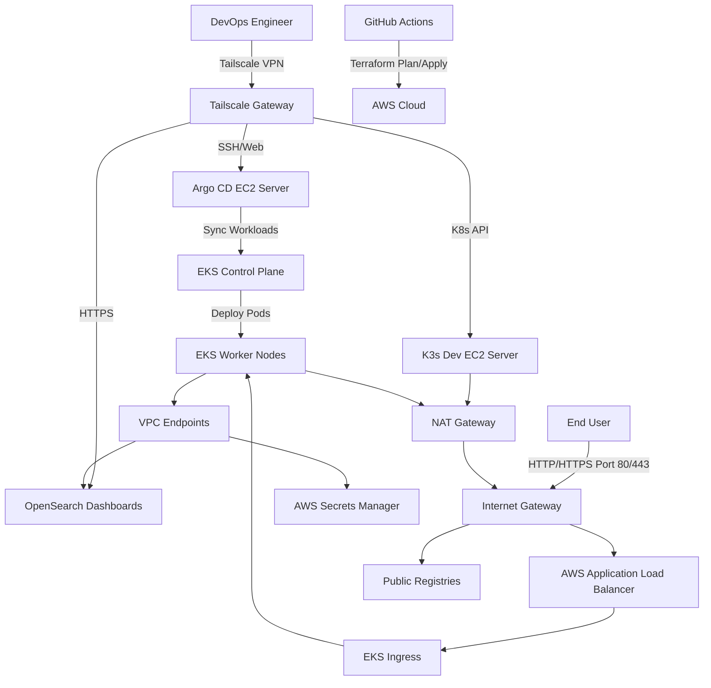

# 🛠️ TikTo AWS Infrastructure (IaC)

This directory contains the modular Terraform configurations to provision the AWS cloud infrastructure for the **TikTo** platform, including the EKS cluster, VPC network, AWS OpenSearch logging domain, and AWS Secrets Manager.

---

## 🗺️ System Topology



---

## 📂 Project Structure

```text
.
├── module/                 # Reusable infrastructure modules
│   ├── vpc/                # Multi-AZ VPC networking
│   ├── ec2/                # Standalone EC2 instances (Argo CD & K3s Dev)
│   ├── eks/                # EKS Cluster & Spot Node Group (Prod)
│   ├── opensearch/         # OpenSearch logging cluster (Prod)
│   └── secrets_manager/    # AWS Secrets Manager module
├── main.tf                 # Orchestration of all modules
├── variables.tf            # Input variable declarations
├── outputs.tf              # Endpoints and metadata outputs
└── terraform.tfvars        # Default configuration values
```

---

## 🚀 How to Spin Up & Configure

### 1. Set Up Environment Variables
Create `terraform.tfvars` from `terraform.tfvars.example` and configure your credentials:
```hcl
aws_region          = "ap-southeast-1"
cluster_name        = "tikto-prod-eks"
tailscale_authkey   = "tskey-auth-..."
```

### 2. Run Terraform Commands
To deploy the infrastructure from your local CLI:
```bash
# Initialize Terraform
terraform init

# Generate & inspect deployment plan
terraform plan -out=tfplan

# Apply changes
terraform apply tfplan
```

### 3. Connect to the EKS Cluster
Once provisioning is completed, update your local kubeconfig to connect:
```bash
aws eks update-kubeconfig --region ap-southeast-1 --name tikto-prod-eks
kubectl get nodes
```

---

## 🔧 Useful Administration Commands

### Install Istio Control Plane (Helm)
```bash
# Add Istio Helm repository
helm repo add istio https://istio-release.storage.googleapis.com/charts
helm repo update

# Install base CRDs & Control Plane
helm upgrade --install istio-base istio/base -n istio-system --create-namespace
helm upgrade --install istiod istio/istiod -n istio-system --wait
```

### Install Istio Ingress Gateway (Helm)
```bash
# Install Ingress Gateway as NodePort for AWS ALB integration
helm upgrade --install istio-ingress istio/gateway -n tikto-prod --set service.type=NodePort --wait
```

---

## 🔍 Troubleshooting & Fixes

### ❌ AWS ALB Ingress Gateway returns 503 (Target.NotInUse)
* **Issue**: Public web access through the AWS Application Load Balancer (ALB) fails with a `503 Service Temporarily Unavailable` error, and the AWS Console shows target groups as `Target.NotInUse`.
* **Cause**: The public ALB is provisioned across subnets in AZs `ap-southeast-1a` and `ap-southeast-1b`, but the EKS scheduler placed the `istio-ingress` pods on a worker node in `ap-southeast-1c`. AWS ALB Target Groups cannot route traffic to targets in AZs where the load balancer itself is disabled unless cross-zone load-balancing is configured.
* **Solution**: Apply a node affinity patch to the `istio-ingress` deployment to restrict scheduling to the active ALB subnets (`ap-southeast-1a` and `ap-southeast-1b`):
  ```yaml
  spec:
    template:
      spec:
        affinity:
          nodeAffinity:
            requiredDuringSchedulingIgnoredDuringExecution:
              nodeSelectorTerms:
              - matchExpressions:
                - key: topology.kubernetes.io/zone
                  operator: In
                  values:
                  - ap-southeast-1a
                  - ap-southeast-1b
  ```

### ❌ AWS ALB Target Group Health Check Fails (404 Not Found)
* **Issue**: The ALB controller marks the ingress targets as unhealthy because the root path `/` on port `80` returns `404 Not Found` (since no default VirtualService matches `/`).
* **Solution**: Customize the ALB ingress annotations to query the native Istio status port `15021` on the path `/healthz/ready`:
  ```yaml
  alb.ingress.kubernetes.io/healthcheck-port: '15021'
  alb.ingress.kubernetes.io/healthcheck-path: /healthz/ready
  ```

### ❌ Pod Creation Blocked by Pod Security Standards (PSS)
* **Issue**: Pods fail to create with error: `violates PodSecurity "baseline:latest": non-default capabilities`.
* **Cause**: The namespace `tikto-prod` enforces `baseline` or `restricted` security profiles, but Istio sidecars require `NET_ADMIN` and `NET_RAW` capabilities to manipulate iptables rules.
* **Solution**: Exclude or set the PSS of the namespace to `privileged` in the namespace labels:
  ```yaml
  pod-security.kubernetes.io/enforce: privileged
  ```
