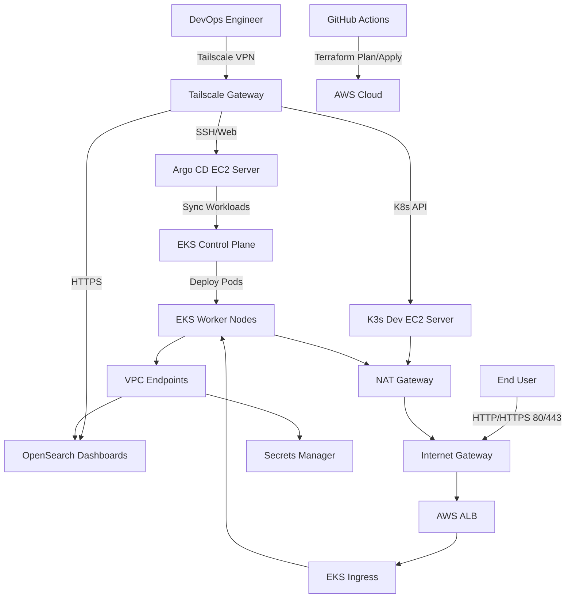

# 🛠️ TikTo — Infrastructure as Code (Terraform)

This repo contains the modular Terraform configurations that provision the AWS infrastructure for **TikTo**: the EKS cluster, VPC network, OpenSearch (logging), and Secrets Manager.

> 🔗 Related repos: [tikto](https://github.com/flavoriy/tikto) (application) · [gitops-manifest](https://github.com/flavoriy/gitops-manifest) (desired state deployed onto this infrastructure)

---

## 🗺️ System Topology



- **Admins** access everything privately via Tailscale VPN — no SSH/API exposed to the internet.
- **Public traffic** only enters through the ALB → EKS Ingress, never touching the admin EC2 instances directly.
- **EKS worker nodes** reach Secrets Manager & OpenSearch through VPC Endpoints (private link), never over the public internet.

---

## 📂 Directory Structure

```
.
├── module/
│   ├── vpc/                # Multi-AZ VPC networking
│   ├── ec2/                # Standalone EC2 instances (Argo CD server & K3s Dev)
│   ├── eks/                # EKS Cluster + Spot Node Group (Prod)
│   ├── opensearch/         # OpenSearch logging cluster (Prod)
│   └── secrets_manager/    # AWS Secrets Manager module
├── main.tf                 # Orchestrates all modules
├── variables.tf
├── outputs.tf               # Endpoints and metadata output
└── terraform.tfvars
```

---

## 🚀 How to Deploy

### 1. Configure environment variables

Copy `terraform.tfvars.example` → `terraform.tfvars` and fill in your credentials:

```hcl
aws_region        = "ap-southeast-1"
cluster_name      = "tikto-prod-eks"
tailscale_authkey = "tskey-auth-..."
```

### 2. Run Terraform

```bash
terraform init
terraform plan -out=tfplan
terraform apply tfplan
```

### 3. Connect to the EKS cluster

```bash
aws eks update-kubeconfig --region ap-southeast-1 --name tikto-prod-eks
kubectl get nodes
```

---

## 🔧 Post-provision Setup

### Istio Control Plane

```bash
helm repo add istio https://istio-release.storage.googleapis.com/charts
helm repo update

helm upgrade --install istio-base istio/base -n istio-system --create-namespace
helm upgrade --install istiod istio/istiod -n istio-system --wait
```

### Istio Ingress Gateway (for AWS ALB)

```bash
helm upgrade --install istio-ingress istio/gateway -n tikto-prod --set service.type=NodePort --wait
```

---

## 🔍 Troubleshooting

### ❌ ALB returns `503 Target.NotInUse`

- **Cause**: the ALB is provisioned across subnets in AZs `ap-southeast-1a`/`1b`, but the scheduler placed the `istio-ingress` pod in AZ `1c` — outside the ALB's target group scope.
- **Fix**: pin the pod to schedule only on the AZs the ALB actually serves:

```yaml
spec:
  template:
    spec:
      affinity:
        nodeAffinity:
          requiredDuringSchedulingIgnoredDuringExecution:
            nodeSelectorTerms:
            - matchExpressions:
              - key: topology.kubernetes.io/zone
                operator: In
                values: ["ap-southeast-1a", "ap-southeast-1b"]
```

### ❌ ALB health check fails (404 Not Found)

- **Cause**: the root path `/` doesn't match any VirtualService, so it returns 404.
- **Fix**: point the health check at Istio's dedicated readiness port instead:

```
alb.ingress.kubernetes.io/healthcheck-port: '15021'
alb.ingress.kubernetes.io/healthcheck-path: /healthz/ready
```

### ❌ Pod creation blocked by Pod Security Standards (PSS)

- **Cause**: the namespace enforces `baseline`/`restricted`, while the Istio sidecar needs `NET_ADMIN` and `NET_RAW` capabilities.
- **Fix**: relax the namespace's PSS level to `privileged`:

```yaml
pod-security.kubernetes.io/enforce: privileged
```

---

## 🧱 Tech stack

`Terraform` `HCL` `AWS EKS` `VPC` `EC2` `OpenSearch` `Secrets Manager` `Istio` `Tailscale`
